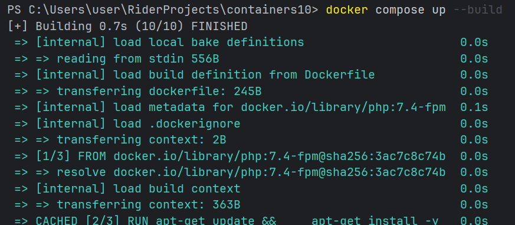
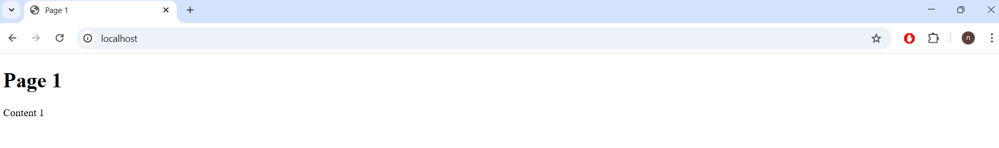
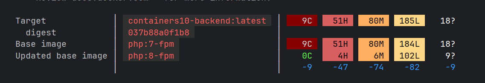

# Лабораторная работа: Управление секретами в контейнерах

## Цель работы

В рамках данной лабораторной работы было изучено управление секретами в контейнерах, а также практически применён Docker Compose для создания многосервисного приложения с безопасной передачей конфиденциальных данных.

## Задание

В ходе работы требовалось выполнить следующее:

- создать многосервисное приложение (nginx + php + mariadb);
- перевести подключение к базе данных с SQLite на MySQL;
- обновить конфигурацию проекта под работу с переменными окружения;
- настроить Dockerfile для работы с MySQL;
- реализовать безопасное хранение секретов с использованием Docker Secrets;
- проверить работоспособность приложения;
- проанализировать безопасность контейнера.

## Ход выполнения работы

### 1. Изменение класса работы с базой данных

В файле `database.php` был изменён конструктор класса. Ранее использовалось подключение к SQLite, после изменений - к MySQL через DSN (строка подключения, в которой указывается тип базы данных, хост, имя базы и кодировка).

**Было:**
```php
public function __construct($path)
```

**Заменили на:**
```php
public function __construct(string $dsn, string $username, string $password)
```

Это изменение позволило передавать параметры подключения снаружи, а не хранить их внутри класса - что важно для гибкости и безопасности.

### 2. Обновление `index.php`

В файле `index.php` был изменён способ создания подключения к базе данных. Теперь строка DSN формируется динамически из конфигурации:

```php
$dsn = "mysql:host={$config['db']['host']};dbname={$config['db']['database']};charset=utf8";

$db = new Database($dsn, $config['db']['username'], $config['db']['password']);
```

Это изменение нужно было для корректной работы с MySQL вместо SQLite.

### 3. Обновление `config.php`

Изначально данные для подключения к базе считывались из этих переменных окружения:

```php
$config['db']['username'] = getenv('MYSQL_USER');
$config['db']['password'] = getenv('MYSQL_PASSWORD');
```

Но это не самый безопасный способ хранить пароли, потому что переменные окружения видны через `docker inspect` и могут попасть в логи.

Поэтому позже, чтобы повысить безопасность, чтение данных было заменено на чтение из файлов Docker Secrets:

```php
$config['db']['username'] = trim(file_get_contents('/run/secrets/user'));
$config['db']['password'] = trim(file_get_contents('/run/secrets/secret'));
```

Функция `trim()` убирает пробелы и переводы строк на концах строки - это критично, потому что файлы секретов часто заканчиваются символом `\n`, который может сломать строку подключения.

### 4. Обновление Dockerfile

В Dockerfile была заменена зависимость с SQLite на MySQL. Была добавлена следующая строка:

```dockerfile
RUN docker-php-ext-install pdo_mysql
```

Эта команда устанавливает PHP-расширение для работы с MySQL через PDO и это стандартный способ работы с базами данных в PHP.

### 5. Настройка nginx

Был создан файл `nginx.conf`, который был взят из лабораторной работы №7.

```nginx
server {
    listen 80;
    server_name _;

    root /var/www/html;
    index index.php;

    location / {
        try_files $uri $uri/ /index.php?$args;
    }

    location ~ \.php$ {
        fastcgi_pass backend:9000;
        fastcgi_index index.php;
        fastcgi_param SCRIPT_FILENAME $document_root$fastcgi_script_name;
        include fastcgi_params;
    }
} 
```

### 6. Настройка docker-compose

Был создан многосервисный проект, включающий три сервиса:

- `frontend` - веб-сервер nginx, принимает HTTP-запросы от пользователя;
- `backend` - PHP-приложение, обрабатывает логику;
- `database` - MariaDB, хранит данные.

Были настроены внутренние сети между сервисами и зависимости (чтобы backend не запускался раньше базы данных).

После настройки проекта была запущена команда 

```bash
docker compose up --build
```



Наш сайт был доступен на `localhost`



### 8. Работа с Docker Secrets

Во второй части работы была создана папка `secrets/` с тремя файлами:

- `root_secret` - пароль root-пользователя базы данных;
- `user` - имя пользователя базы данных;
- `secret` - пароль пользователя базы данных.

В `docker-compose.yml` секреты были объявлены следующим образом:

```yaml
secrets:
  root_secret:
    file: ./secrets/root_secret
  user:
    file: ./secrets/user
  secret:
    file: ./secrets/secret
```

В сервисе `database` они были использованы через специальные переменные с суффиксом `_FILE`:

```yaml
MYSQL_PASSWORD_FILE: /run/secrets/secret
```
MariaDB и MySQL поддерживают переменные с суффиксом `_FILE` - вместо прямого значения они читают содержимое указанного файла. Это стандартный механизм интеграции с Docker Secrets.

### 9. Проверка безопасности

Для оценки уязвимостей образа была выполнена команда:

```bash
docker scout quickview containers10-backend
```
**Docker Scout** - встроенный инструмент Docker для анализа образов на известные уязвимости (CVE). Он показывает, какие пакеты в образе имеют известные проблемы безопасности и насколько они критичны.



На скриншоте видно, что Docker Scout нашел 9 критических уязвимостей, которые возникают из-за устаревшей и небезопасной версии `php:7-fpm`

Кроме этого было найдено 51H(высоких), 80M(средних), 185L(низких) уязвимостей. То есть в текущем виде текущий образ не самый безопасный, его необходимо улучшить и оптимизировать.

## Ответы на вопросы

### 1. Почему плохо передавать секреты в образ при сборке?
Когда пароль или другой секрет прописывается прямо в Dockerfile или копируется в образ на этапе `docker build`, он навсегда оказывается «зашит» внутри этого образа. Каждый слой образа сохраняется, и даже если в следующем слое файл с паролем удалить, в истории образа он всё равно останется - его можно извлечь командой `docker history` или просто распаковав образ.

Это означает, что:

- любой человек, у которого есть доступ к образу (например, через Docker Hub), сможет увидеть секрет;
- если образ утечёт - утечёт и пароль;
- чтобы сменить пароль, придётся заново пересобирать и перевыкладывать весь образ;
- в командах разработки образы часто отправляются друг другу между людьми - и все они получат доступ к секретам.

Поэтому секреты никогда не должны попадать в образ. Они должны передаваться контейнеру уже в момент запуска, а не сборки.

### 2. Как можно безопасно управлять секретами в контейнерах?

Есть несколько подходов, от простых к более продвинутым.

**Переменные окружения** - самый простой способ. Значения передаются при запуске контейнера через `environment:` в Compose или через флаг `-e`. Минус в том, что их видно через `docker inspect`, они могут попасть в логи, и любой процесс внутри контейнера их видит.

**Docker Secrets** - более безопасный способ, который использовался в данной работе. Секреты хранятся отдельно от образа, монтируются в контейнер как файлы в `/run/secrets/` только во время работы, и приложение читает их через `file_get_contents`. Плюс в том, что секреты не видны снаружи контейнера и не хранятся в образе.

**Внешние системы управления секретами** - профессиональный подход для больших проектов. Например:
- **HashiCorp Vault** - отдельный сервис, который хранит секреты, ротирует их автоматически и выдаёт только тем сервисам, которым разрешено;
- **Kubernetes Secrets** - встроенный механизм в Kubernetes, аналогичный Docker Secrets;
- **AWS Secrets Manager**, **Azure Key Vault** и подобные - облачные решения от провайдеров.

Для учебных и небольших проектов Docker Secrets вполне достаточно. Для продакшн-систем стоит смотреть в сторону Vault или облачных решений.

### 3. Как использовать Docker Secrets?

Процесс состоит из четырёх шагов.

**Шаг 1 - создать файлы с секретами.** В папке проекта создаётся директория `secrets/`, в которой хранятся файлы с паролями и логинами. Важно: файлы должны быть сохранены в UTF-8 без BOM, иначе в начале строки окажется невидимый символ, который сломает подключение.

**Шаг 2 - объявить секреты в `docker-compose.yml`.** В нижней части файла указывается, какие секреты существуют и где лежат их файлы:

```yaml
secrets:
  db_password:
    file: ./secrets/db_password
```

**Шаг 3 - подключить секреты к нужному сервису.** В описании сервиса указывается, какие секреты ему доступны:

```yaml
services:
  backend:
    secrets:
      - db_password
```

После этого внутри контейнера появится файл `/run/secrets/db_password` с содержимым из исходного файла.

**Шаг 4 - читать секрет в приложении.** В PHP (и любом другом языке) секрет читается как обычный файл:

```php
$password = trim(file_get_contents('/run/secrets/db_password'));
```

`trim()` здесь обязателен - убирает перенос строки в конце файла, который иначе попадёт в пароль и сломает подключение.

## Выводы

В ходе лабораторной работы были изучены принципы работы Docker Compose, взаимодействие нескольких контейнеров и настройка nginx как точки входа. Было выполнено подключение PHP-приложения к MySQL, а также реализован механизм безопасного хранения секретов через Docker Secrets.

В результате получилось работающее многосервисное приложение, в котором конфиденциальные данные не хранятся ни в коде, ни в образе, а передаются контейнеру в момент запуска через защищённый механизм файловых секретов.